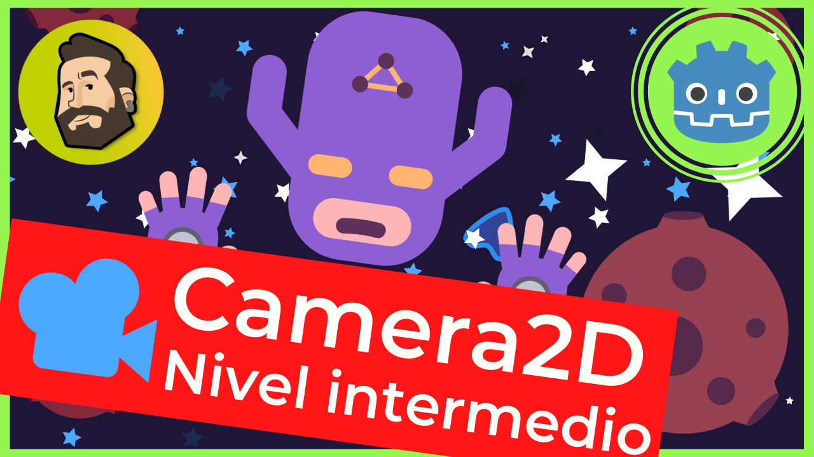
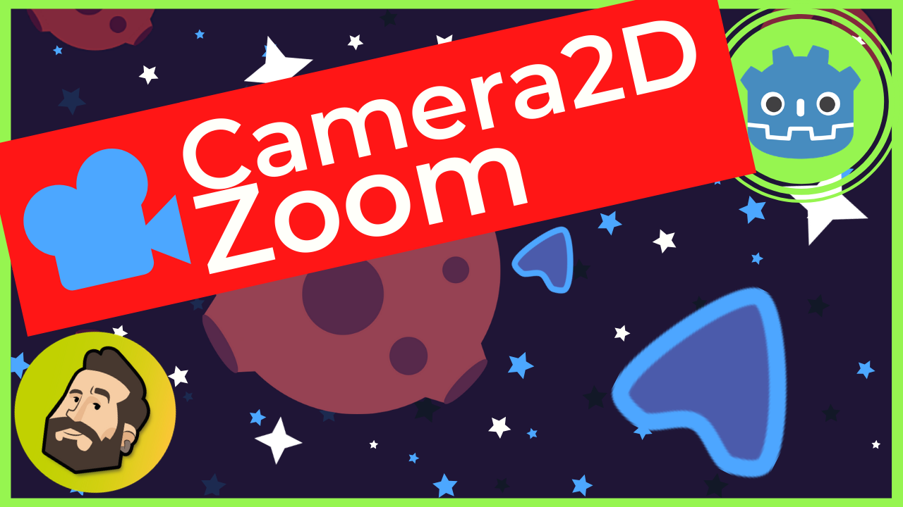

# Tutoriales-Godot
Tutoriales específicos sobre Godot del canal de Youtube de Raformatico.

**Consulta todos los videotutoriales de la serie en la [playlist](https://www.youtube.com/watch?v=rd-qEr2Ssuw&list=PLpdhBEtT9SDmhwTkm2XD-MAkpsQePOoVe)**

Esta lista de tutoriales nace de la colaboración con [GDQuest](https://www.youtube.com/c/gdquest) en la que estoy haciendo tutoriales cortos sobre nodos específicos de Godot.

### ¿Cómo colaborar con el proyecto?

Si tras hacer el curso te sientes agradecido y quieres apoyarme puedes hacerlo de alguna de las siguientes maneras:

- Marcando este repositorio como favorito para facilitar que otra gente pueda encontrarlo
- Comentando y valorando positivamente el curso en [Udemy](https://www.udemy.com/course/godot-3-primer-videojuego/) o [Tutellus](https://www.tutellus.com/tecnologia/videojuegos/haz-tu-primer-videojuego-con-godot-32-30039)
- Suscribiéndote a [mi canal de YouTube de Raformático](https://www.youtube.com/c/raformatico) y comentando positivamente o indicando que te gusta lo que hago. Ya sabes que la interacción social es lo que más valora YouTube para recomendar los vídeos a otras personas...
- [Invitándome a un cafelito](https://www.buymeacoffee.com/raformatico), me viene muy bien para tomar energía y hacer más cursos ;D

### Lista de tutoriales

#### Camera2D: ¿Cómo cambiar el zoom y la posición de la cámara dinámicamente?*Carpeta CamaraDinamica*

*consulta el videotutorial [aquí](https://youtu.be/XfN44KdzZw4) y su versión más larga [paso a paso](). También tenéis la versión escrita para GDQuest [aquí](https://www.gdquest.com/tutorial/godot/2d/anchor-camera/)* 

#### Camera2D: ¿Cómo hacer zoom con la rueda del ratón en Godot? *Carpeta ZoomCamara*

*consulta el videotutorial [aquí](https://youtu.be/XfN44KdzZw4) y la versión escrita para GDQuest [aquí](https://www.gdquest.com/tutorial/godot/2d/camera-zoom/)* 